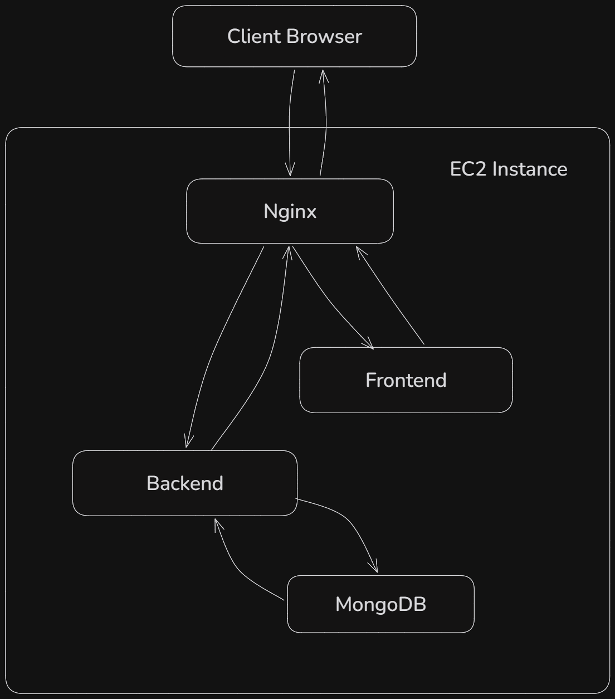
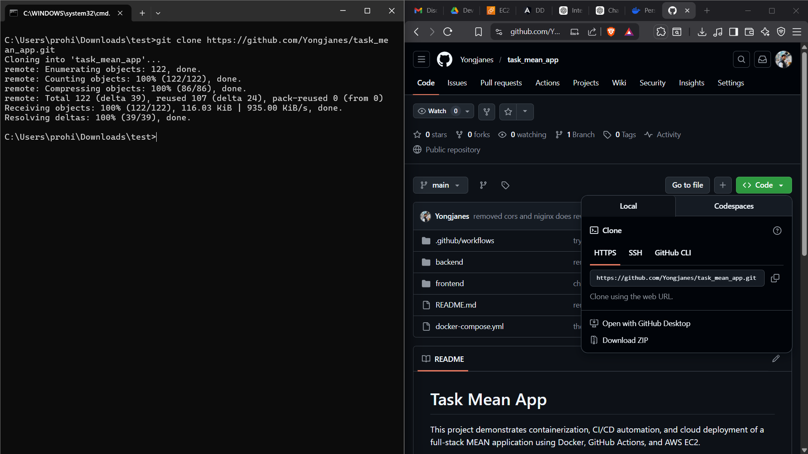
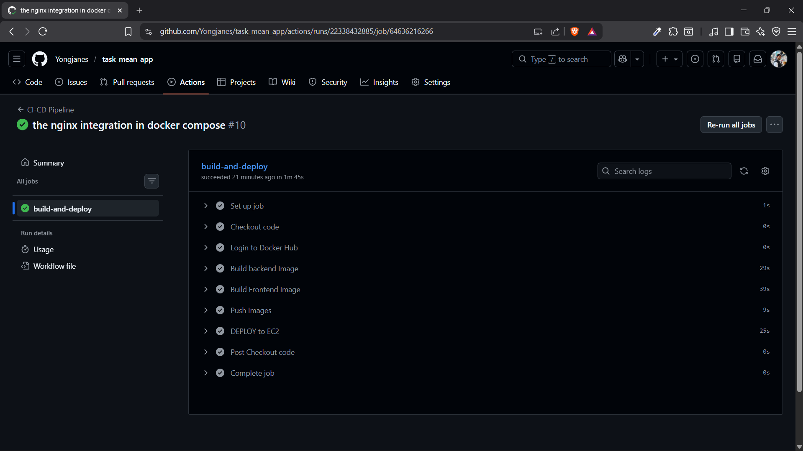
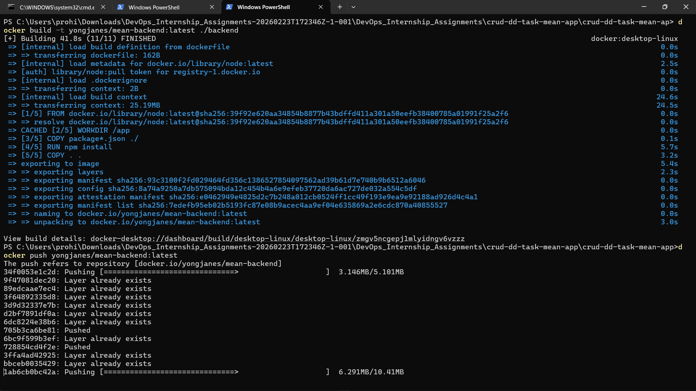
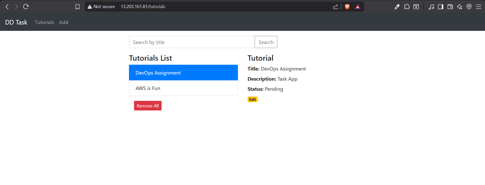

# MEAN Stack Application with Docker & CI/CD Deployment

This project demonstrates the complete containerization, CI/CD automation, reverse proxy configuration, and cloud deployment of a full-stack MEAN (MongoDB, Express, Angular, Node.js) application.

The application is fully Dockerized, deployed on AWS EC2, and automated using GitHub Actions.



## 📋 Prerequisites / Requirements

Before starting, ensure you have the following installed on your local machine:
- Git
- Docker (v20+ recommended)
- Docker Compose (v2+ recommended)
- Node.js (Optional, only if running without Docker)

Verify your installations:
```bash
git --version
docker --version
docker-compose --version
```

---

## 🚀 1. Clone the Repository

To get started, clone this repository to your local machine:

```bash
git clone https://github.com/Yongjanes/task_mean_app.git
cd task_mean_app
```



---

## ⚙️ 2. Local Deployment

1. Make sure you are in the root directory of the project.
2. Build and start the containers in detached mode:
   ```bash
   docker-compose up -d --build
   ```
3. Check the status of your containers to verify everything is running:
   ```bash
   docker-compose ps
   ```

**App Access Points:**
- **Frontend App:** http://localhost:8081 (Or http://localhost if hitting NGINX directly depending on `default.conf`)
- **Backend API:** http://localhost:8080
- **MongoDB Database:** Running securely internally on port 27017.

---

## 🌐 3. NGINX Configuration

This project includes a pre-configured NGINX reverse proxy to route traffic between the frontend and backend services cleanly on both local and EC2 environments.

The configuration (`nginx/default.conf`) is set up as follows:
```nginx
server {
        listen 80;

        location / {
                proxy_pass http://frontend:80;
                proxy_http_version 1.1;
                proxy_set_header Host $host;
        }

        location /api/ {
                proxy_pass http://backend:8080;
                proxy_http_version 1.1;
                proxy_set_header Host $host;
        }
}
```

This configuration ensures:
- All `/` traffic goes to the Angular Frontend container via `http://localhost`.
- All `/api/` traffic goes to the Node.js/Express Backend container.

---

## ☁️ 4. CI/CD Configuration (GitHub Actions)

This project uses **GitHub Actions** to automate building the Docker images, pushing them to Docker Hub, and deploying the new stack to an AWS EC2 instance.

The CI/CD workflow strictly triggers on pushes to the `main` branch. It securely logs into Dockerhub using GitHub action secrets to push fresh builds, then initiates an SSH session to the EC2 server to easily swap to the newly generated containers via an automated `docker-compose up -d`.

### The Pipeline Config (`.github/workflows/deploy.yml`):
```yaml
name: CI-CD Pipeline
on:
  push:
    branches:
      - main
jobs:
  build-and-deploy:
    runs-on: ubuntu-latest
    environment: PROD
    steps:
      - name: Checkout code
        uses: actions/checkout@v3
      - name: Login to Docker Hub
        run: echo "${{ secrets.DOCKER_PASSWORD }}" | docker login -u "${{ secrets.DOCKER_USERNAME }}" --password-stdin
      - name: Build backend Image
        run: docker build -t ${{ secrets.DOCKER_USERNAME }}/mean-backend:latest ./backend
      - name: Build Frontend Image
        run: docker build -t ${{ secrets.DOCKER_USERNAME }}/mean-frontend:latest ./frontend
      - name: Push Images
        run: |
          docker push ${{ secrets.DOCKER_USERNAME }}/mean-backend:latest
          docker push ${{ secrets.DOCKER_USERNAME }}/mean-frontend:latest
      - name: DEPLOY to EC2
        uses: appleboy/ssh-action@master
        with:
          host: ${{ secrets.EC2_HOST }}
          username: ${{ secrets.EC2_USER }}
          key: ${{ secrets.EC2_SSH_KEY }}
          script: |
            cd dd_task_mean_app
            docker-compose down
            docker-compose pull
            docker-compose up -d
```

### Required GitHub Secrets:
Add these to `Settings` > `Secrets and variables` > `Actions`:
- `DOCKER_USERNAME`
- `DOCKER_PASSWORD`
- `EC2_HOST` (IP or Domain of your EC2 instance)
- `EC2_USER` (Typically `ubuntu` or `ec2-user`)
- `EC2_SSH_KEY` (The private PEM key to access the EC2 instance)

---

## 🌍 5. AWS EC2 Cloud Deployment

To host this application natively on an EC2 instance:
1. **Launch an EC2 Instance** (Ubuntu 22.04 LTS is highly recommended).
2. **Configure Security Rules** to allow Inbound Traffic on Ports: `80` (HTTP), `8080` (Backend API), `8081` (Frontend), and `22` (SSH).
3. **SSH Into the Server**:
   ```bash
   ssh -i your-key.pem ubuntu@<your-ec2-ip-address>
   ```
4. **Install Docker and Docker-Compose CLI** on your EC2 instance.
5. **Clone the Repo** natively into your target directory:
   ```bash
   git clone <repository-url> dd_task_mean_app
   ```
6. Whenever you push new code to the `main` branch, **GitHub Actions** will automatically rebuild the images remotely and deploy them onto your EC2 seamlessly.

### (Optional) Setting up NGINX directly on the EC2 Host OS
If you prefer to run NGINX directly on the EC2 instance (instead of via Docker), you can set it up manually:

1. **Install NGINX:**
   ```bash
   sudo apt update
   sudo apt install nginx -y
   ```
2. **Create the configuration file:**
   ```bash
   sudo nano /etc/nginx/sites-available/mean_app
   ```
3. **Paste the routing block** inside the file and save:
   ```nginx
   server {
           listen 80;

           location / {
                   proxy_pass http://localhost:8081; # Assuming frontend port is 8081 mapped to host
                   proxy_http_version 1.1;
                   proxy_set_header Host $host;
           }

           location /api/ {
                   proxy_pass http://localhost:8080; # Assuming backend port is 8080 mapped to host
                   proxy_http_version 1.1;
                   proxy_set_header Host $host;
           }
   }
   ```
4. **Enable the site and restart NGINX:**
   ```bash
   sudo ln -s /etc/nginx/sites-available/mean_app /etc/nginx/sites-enabled/
   sudo rm /etc/nginx/sites-enabled/default
   sudo systemctl restart nginx
   ```
   *(Note: If you do this, ensure you remove the `nginx` container from your `docker-compose.yml` and expose the frontend on port `8081:80` and backend on `8080:8080` to the host.)*

---

## 📸 Screenshots & Proof of Work

The core features, execution, and environments are illustrated in the screenshots below:

### 1. CI/CD Configuration and Execution
*(Demonstrating successful GitHub Actions Trigger)*


### 2. Docker Image Build and Push Process
*(Docker container registry successful push event logs)*


### 3. Application Deployment and Working UI
*(The live running Front-End application functionality)*

